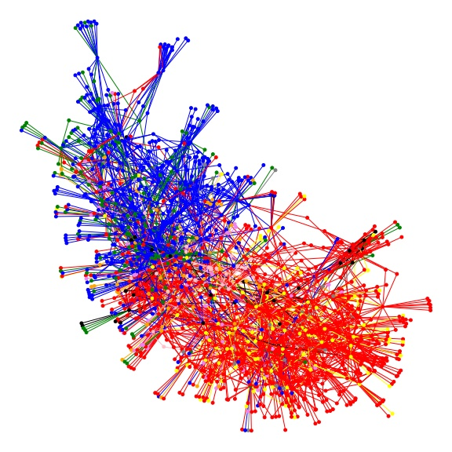

### Arxiv quantitative finance papers information extraction  
1. Downloading pdfs from Arxiv.  
2. PDF to txt conversion.  
3. Word2Vec preprocessing and training.  
4. Network graphing informational distance.  


#### Linux and OSX  
```
pip3 install -r requirements.txt
```

  
**Arxiv quantitative finance categories:** *'CP': 'red', 'EC': 'blue', 'GN': 'green', 'MF': 'grey', 'PM': 'black', 'PR': 'yellow','RM': 'violet', 'ST': 'orange', 'TR': 'pink'*