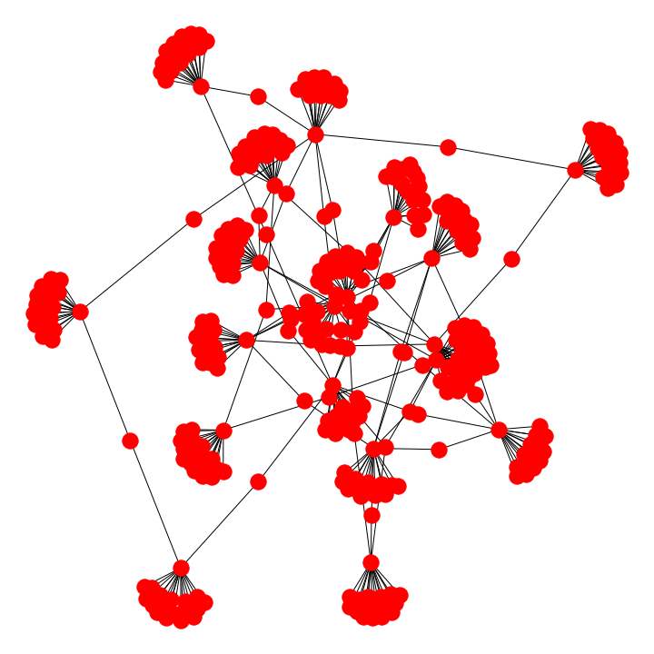

### Arxiv paper information extraction  
1. Downloading pdfs from Arxiv.  
2. PDF to txt conversion.  
3. Word2Vec preprocessing and training.  
4. Network graphing informational distance.  


#### Linux or OSX  
```
pip3 install -r requirements.txt
```

