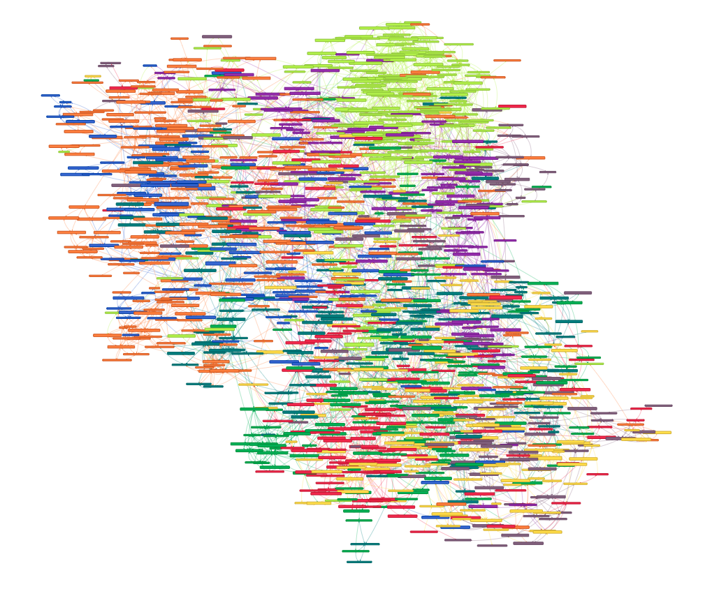

### Arxiv quantitative finance papers information extraction  
1. Downloading pdfs from Arxiv.  
2. PDF to txt conversion.  
3. Word2Vec preprocessing and training.  
4. Network graphing informational distance.  


##### Linux and OSX  
```
pip3 install -r requirements.txt  
npm install vis
```
##### Launch vis.js network representation of q-fin  
```
chmod a+rx examples/launch.sh
./examples/launch.sh
```
Refresh the site.  


  
Graph zoom sample:
  
**Arxiv quantitative finance categories:**  
*'CP': 'red', 'EC': 'blue', 'GN': 'green', 'MF': 'grey', 'PM': 'black', 'PR': 'yellow','RM': 'violet', 'ST': 'orange', 'TR': 'pink'*
  
CP - Computational Finance  
EC - Economics  
GN - General Finance  
MF - Mathematical Finance  
PM - Portfolio Management  
PR - Pricing of Securities  
RM - Risk Management  
ST - Statistical Finance  
TR - Trading and Market Microstructure  
